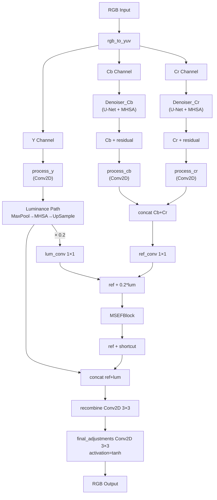

# LYT-Net 模型架構研究分析

> **論文**: LYT-Net: Lightweight YUV Transformer-based Network for Low-Light Image Enhancement  
> **作者**: Brateanu, A., Balmez, R., Avram A., Orhei, C.C. (2024)  
> **程式碼版本**: TensorFlow (`model_modify/arch.py`)  
> **分析日期**: 2026-04-30

---

## 一、架構總覽

LYT-Net 是一個**輕量級低光影像增強模型**，核心設計理念為：

1. 將 RGB 輸入轉換至 **YUV 色彩空間**，分離亮度 (Y) 與色度 (Cb/Cr)
2. 對色度通道使用專用 **Denoiser** 去噪
3. 對亮度通道使用 **Multi-Head Self-Attention (MHSA)** 捕捉全域依賴
4. 透過 **MSEF Block** 融合亮度與色度特徵
5. 最終重組輸出增強後的 RGB 影像



**模型規格**: ~0.045M 參數 | ~3.49 GFLOPs (256×256 輸入)

---

## 二、模塊詳細分析

### 2.1 SEBlock（Squeeze-and-Excitation Block）

> [arch.py:22-33](file:///d:/%E4%BA%BA%E5%B7%A5%E6%99%BA%E6%85%A7%E8%AA%B2%E7%A8%8B%201142/LYT-Net-main/TensorFlow/model_modify/arch.py#L22-L33)

| 元素 | 設定 |
|------|------|
| GlobalAveragePooling2D | 壓縮空間維度為 1×1 |
| Dense (fc1) | `channels // 16` → ReLU |
| Dense (fc2) | `channels` → **tanh** |
| 輸出 | `inputs × scale` (通道注意力加權) |

**設計特點**:
- 使用 `tanh` 而非傳統 SE 的 `sigmoid`，允許 scale 值為負 (-1 ~ +1)，可實現通道反轉
- Reduction ratio = 16，當 filters=32 時，瓶頸為 2 個神經元

**潛在風險**: 當 filters=16（Denoiser 內部）時，`16 // 16 = 1`，瓶頸退化為單一神經元，表達能力極度受限。

---

### 2.2 MSEFBlock（Multi-Stage Squeeze & Excite Fusion）

> [arch.py:7-20](file:///d:/%E4%BA%BA%E5%B7%A5%E6%99%BA%E6%85%A7%E8%AA%B2%E7%A8%8B%201142/LYT-Net-main/TensorFlow/model_modify/arch.py#L7-L20)

```
Input → LayerNorm → ┬─ DepthwiseConv2D(3×3) → x1 ─┐
                     └─ SEBlock            → x2 ─┤
                                            Multiply(x1, x2) → Add(input) → Output
```

**分析**:
- **LayerNormalization (axis=-1)**: 沿通道維度正規化，穩定特徵分布
- **DepthwiseConv2D**: 提取局部空間特徵，參數量極少（每通道一個 3×3 kernel）
- **SEBlock**: 提供全域通道注意力權重
- **Multiply 融合**: x1 (局部) × x2 (全域) 實現跨尺度特徵選擇
- **殘差連接**: 保證梯度流通與特徵保留

**角色**: 在 LYT 主模型中僅使用一次，用於融合亮度引導後的色度特徵。

---

### 2.3 MultiHeadSelfAttention（MHSA）

> [arch.py:35-74](file:///d:/%E4%BA%BA%E5%B7%A5%E6%99%BA%E6%85%A7%E8%AA%B2%E7%A8%8B%201142/LYT-Net-main/TensorFlow/model_modify/arch.py#L35-L74)

| 參數 | Denoiser 中 | LYT 亮度路徑 |
|------|------------|-------------|
| embed_size | 16 | 32 |
| num_heads | 4 | 4 |
| head_dim | 4 | 8 |

**處理流程**:
1. 輸入 (B, H, W, C) 直接作為 token 序列 (B, H×W, C)
2. 線性投影生成 Q, K, V
3. Split heads → Scaled Dot-Product Attention → Concat → 線性投影
4. Reshape 回 (B, H, W, C)

**關鍵設計**: 
- Denoiser 中在 **1/8 解析度** 下運行（經 3 次 stride-2 下採樣），序列長度從 H×W 降至 (H/8)×(W/8)
- LYT 亮度路徑在 **MaxPool(8)** 後運行，同樣大幅降低計算量
- **無位置編碼**: 完全依賴內容相似度，喪失空間位置資訊

**計算複雜度**: O(n²·d)，其中 n = (H/8)×(W/8)。256×256 輸入時 n = 1024，可控。

---

### 2.4 Denoiser（通道去噪器 / CWD）

> [arch.py:76-100](file:///d:/%E4%BA%BA%E5%B7%A5%E6%99%BA%E6%85%A7%E8%AA%B2%E7%A8%8B%201142/LYT-Net-main/TensorFlow/model_modify/arch.py#L76-L100)

```
Input(1ch) → Conv(s1) → Conv(s2) → Conv(s2) → Conv(s2) → MHSA → Up → Up → Up → res_layer → output_layer
               x1          x2         x3         x4                          ↑skip  ↑skip  ↑skip
```

**U-Net 結構**: Encoder 4 層卷積 + MHSA Bottleneck + Decoder 3 層上採樣 + Skip Connections

| 層 | 輸出尺寸 (H=256) | 通道 |
|----|-----------------|------|
| conv1 (stride=1) | 256×256 | 16 |
| conv2 (stride=2) | 128×128 | 16 |
| conv3 (stride=2) | 64×64 | 16 |
| conv4 (stride=2) | 32×32 | 16 |
| MHSA bottleneck | 32×32 | 16 |
| up4 + skip(x3) | 64×64 | 16 |
| up3 + skip(x2) | 128×128 | 16 |
| up2 + skip(x1) | 256×256 | 16 |
| res_layer (tanh) | 256×256 | 1 |
| output_layer (tanh) | 256×256 | 1 |

**重要細節**:
- 輸入/輸出都是**單通道** (Cb 或 Cr)
- 最終使用 `tanh` 激活，輸出範圍 [-1, 1]
- `output_layer(x + inputs)`: 殘差學習 — 學習「修正量」而非完整輸出
- **Cb 和 Cr 使用獨立的 Denoiser 實例**，不共享權重
- Skip connection 使用**加法** (非 concat)，保持通道數不變

---

### 2.5 LYT 主模型

> [arch.py:102-151](file:///d:/%E4%BA%BA%E5%B7%A5%E6%99%BA%E6%85%A7%E8%AA%B2%E7%A8%8B%201142/LYT-Net-main/TensorFlow/model_modify/arch.py#L102-L151)

#### 處理管線詳解:

**Step 1 — 色彩空間轉換與通道分離**
```python
ycbcr = tf.image.rgb_to_yuv(inputs)    # RGB → YUV
y, cb, cr = tf.split(ycbcr, 3, axis=-1) # 分離三通道
```

**Step 2 — 色度去噪（殘差方式）**
```python
cb = self.denoiser_cb(cb) + cb  # Denoiser 輸出 + 原始 = 去噪結果
cr = self.denoiser_cr(cr) + cr
```

> [!WARNING]
> 這裡存在**雙重殘差**: Denoiser 內部已有殘差 (`output_layer(x + inputs)`)，外部又加一次 `+ cb`。等效於 `output(res(cb)) + cb`，可能導致原始噪聲信號保留過多。

**Step 3 — 獨立特徵提取**
```python
y_processed  = self.process_y(y)   # Conv2D(32, 3×3, relu)
cb_processed = self.process_cb(cb) # Conv2D(32, 3×3, relu)
cr_processed = self.process_cr(cr) # Conv2D(32, 3×3, relu)
```

每個 `process_*` 僅包含**一層 Conv2D**（`range(1)`），特徵提取能力有限。

**Step 4 — 亮度路徑（全域注意力）**
```python
lum = y_processed                    # (B, H, W, 32)
lum_1 = self.lum_pool(lum)           # MaxPool(8) → (B, H/8, W/8, 32)
lum_1 = self.lum_mhsa(lum_1)         # MHSA → (B, H/8, W/8, 32)
lum_1 = self.lum_up(lum_1)           # UpSample(8) → (B, H, W, 32)
lum = lum + lum_1                    # 殘差融合
```

**Step 5 — 亮度引導色度融合**
```python
ref = tf.concat([cb_processed, cr_processed], axis=-1)  # (B,H,W,64)
ref = self.ref_conv(ref)          # 1×1 Conv → (B,H,W,32)
shortcut = ref
ref = ref + 0.2 * self.lum_conv(lum)  # 亮度以 0.2 權重引導色度
ref = self.msef(ref)              # MSEF 融合
ref = ref + shortcut              # 殘差
```

> [!NOTE]
> `0.2` 是硬編碼的亮度引導權重，控制亮度資訊對色度調整的影響程度。

**Step 6 — 最終輸出**
```python
recombined = self.recombine(tf.concat([ref, lum], axis=-1))  # (B,H,W,64)→(B,H,W,32)
output = self.final_adjustments(recombined)                   # (B,H,W,32)→(B,H,W,3), tanh
```

輸出為 tanh 範圍 [-1, 1]，後續需要 `(output + 1) / 2` 轉回 [0, 1]。

---

## 三、損失函數設計

> [losses.py](file:///d:/%E4%BA%BA%E5%B7%A5%E6%99%BA%E6%85%A7%E8%AA%B2%E7%A8%8B%201142/LYT-Net-main/TensorFlow/model_modify/losses.py)

$$\mathcal{L}_{total} = 1.0 \cdot L_{smooth} + 0.06 \cdot L_{perc} + 0.05 \cdot L_{hist} + 0.0083 \cdot L_{psnr} + 0.25 \cdot L_{color} + 0.5 \cdot L_{ms\text{-}ssim}$$

| 損失函數 | 權重 | 功能 |
|---------|------|------|
| Smooth L1 | 1.00 | 像素級重建（對離群值魯棒） |
| MS-SSIM | 0.50 | 多尺度結構相似性 |
| Color | 0.25 | 全局色彩均值一致性 |
| Perceptual (VGG19 block3_conv3) | 0.06 | 高階語義特徵一致性 |
| Histogram | 0.05 | 像素強度分布匹配 |
| PSNR | 0.0083 | 峰值信噪比最大化 (40 - PSNR) |

**特點**: Smooth L1 權重最高，主導像素級精確重建；MS-SSIM 次之，確保結構保真。

---

## 四、訓練策略

> [scheduler.py](file:///d:/%E4%BA%BA%E5%B7%A5%E6%99%BA%E6%85%A7%E8%AA%B2%E7%A8%8B%201142/LYT-Net-main/TensorFlow/model_modify/scheduler.py) & [train.py](file:///d:/%E4%BA%BA%E5%B7%A5%E6%99%BA%E6%85%A7%E8%AA%B2%E7%A8%8B%201142/LYT-Net-main/TensorFlow/scripts/train.py)

| 項目 | 設定 |
|------|------|
| Optimizer | Adam |
| 初始學習率 | 2e-4 |
| 最低學習率 | 1e-6 |
| 排程 | Cosine Decay with Warm Restarts |
| 首次衰減步數 | 150 epochs |
| 衰減倍率 (t_mul) | 2.0 |
| 總 Epochs | 1000 |
| Batch Size | 1 |
| 隨機裁切 | 256×256 |
| 資料增強 | 水平/垂直翻轉 + 隨機旋轉 |

---

## 五、改進方向研究

### 5.1 引入頻域注意力機制

**問題**: 當前 MHSA 僅在空間域操作，對紋理細節與噪聲的區分能力有限。

**建議**: 在 Denoiser 的 bottleneck 或 MSEF 中加入 FFT-based 頻域注意力分支：
- 對特徵圖做 2D FFT，分離低頻結構與高頻細節/噪聲
- 學習頻域權重圖進行選擇性增強/抑制
- 與空間注意力並行融合

**預期效果**: 更好的去噪-保細節平衡。

---

### 5.2 修復雙重殘差問題

**問題**: Denoiser 內部 (`output_layer(x + inputs)`) 和外部 (`denoiser(cb) + cb`) 構成雙重殘差。

**建議方案**:
- **方案 A**: 移除外部殘差，讓 Denoiser 直接輸出去噪結果
- **方案 B**: 移除 Denoiser 內部殘差，外部殘差保留
- **方案 C**: 加入可學習的殘差權重 `α * denoiser(cb) + (1-α) * cb`

---

### 5.3 加入位置編碼

**問題**: MHSA 完全缺乏位置資訊，無法區分空間相對位置。

**建議**: 加入 2D 相對位置編碼 (Relative Positional Encoding) 或可學習的絕對位置嵌入，特別是在亮度路徑的 MHSA 中，有助於處理空間結構性的光照變化。

---

### 5.4 增強特徵提取深度

**問題**: `_create_processing_layers` 僅使用**一層 Conv2D** (`range(1)`)，限制了 Y/Cb/Cr 各通道的特徵表達能力。

**建議**:
- 增加到 2-3 層卷積（可搭配殘差連接）
- 或使用輕量 MobileNet-style 的 Depthwise Separable Convolutions 堆疊

---

### 5.5 動態亮度引導權重

**問題**: `ref = ref + 0.2 * self.lum_conv(lum)` 中的 `0.2` 是固定值。

**建議**: 改為可學習參數 (`self.lum_weight = tf.Variable(0.2)`) 或根據輸入自適應計算：
```python
weight = self.weight_net(lum)  # 小型 MLP 輸出 scalar
ref = ref + weight * self.lum_conv(lum)
```

---

### 5.6 跨通道交互增強

**問題**: Y/Cb/Cr 三通道在大部分處理階段是完全獨立的，僅在最後一步融合。

**建議**: 
- 在特徵提取階段加入跨通道注意力 (Cross-Attention)，讓色度通道能參考亮度資訊
- 或使用 Channel Shuffle 策略定期交換跨通道特徵

**預期效果**: 減少亮度調整導致的色彩偏移問題。

---

## 六、總結

LYT-Net 以極小的參數量（~45K）實現了競爭力的低光增強效果，其 YUV 分離處理策略和輕量 Transformer 設計是核心創新。主要的改進空間集中在：

| 優先級 | 改進方向 | 難度 | 預期收益 |
|--------|---------|------|---------|
| ⭐⭐⭐ | 修復雙重殘差 | 低 | 中等 |
| ⭐⭐⭐ | 動態亮度引導權重 | 低 | 中等 |
| ⭐⭐ | 增強特徵提取深度 | 低 | 中等 |
| ⭐⭐ | 加入位置編碼 | 中 | 中等 |
| ⭐ | 頻域注意力 | 高 | 高 |
| ⭐ | 跨通道交互 | 高 | 高 |
