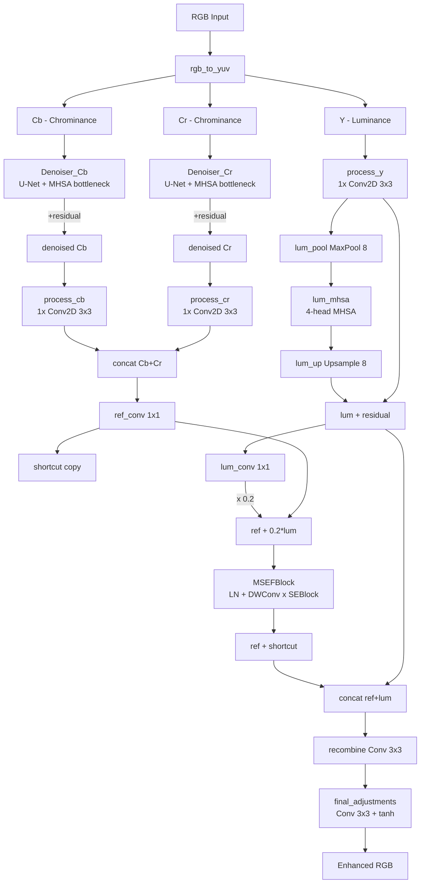

# LYT-Net — paper-master 基準文檔

> 最後更新：2026-05-04
> 基準版本：v1
> 由 paper-master skill 建立（首次分析）

## 專案身分證

| 項目 | 內容 |
|---|---|
| 專案名稱 | LYT-Net (Lightweight YUV Transformer-based Network for Low-Light Image Enhancement) |
| 定位一句話 | 一個只有 ~45K 參數、3.49 GFLOPs 的輕量化 Transformer LLIE 網路，用 YUV 雙路徑分別處理亮度／色度。 |
| 主要技術棧 | TensorFlow 2.x（主版本，論文結果） + PyTorch 1.x（次版本，社群移植）；Python 3.9；VGG19 perceptual loss；Adam + Cosine Restart |
| 入口點 | `TensorFlow/scripts/train.py`、`TensorFlow/scripts/test.py`；PyTorch 版 `PyTorch/train.py`、`PyTorch/test.py` |
| 專案規模 | 模型核心 ~150 行（`arch.py`）、loss 60 行、訓練腳本 ~200 行；參數量 ≈ 0.045M |
| 授權 | 未在 README 明示（依論文發表為 IEEE SPL 2025） |
| 儲存庫 | 本地：`D:\人工智慧課程 1142\LYT-Net-main`；GitHub：[albrateanu/LYT-Net](https://github.com/albrateanu/LYT-Net) |
| 論文 | arXiv:2401.15204；IEEE SPL DOI 10.1109/LSP.2025.3563125 |

## 一句話定位

LYT-Net 把 RGB 影像轉到 YUV 空間後，**亮度通道走 MaxPool→MHSA→UpSample 的全域注意力路徑**、**色度通道走 U-Net + bottleneck MHSA 的去噪路徑**，再用 MSEFBlock 做亮度引導融合。它的價值在於以極低 FLOPs（3.49 G）達到 PSNR 27–29 dB 的 LOL 系列 SOTA，是 LLIE 領域目前最輕量的 Transformer 方案之一。本專案為人工智慧 1142 期末報告所用，研究方向是分析其架構並提出改進／遷移方向，**最終以 LaTeX 撰寫報告**（不公開發表）。

## 架構地圖



**主要資料流**：

```mermaid
sequenceDiagram
    participant Loader as DataLoader
    participant Model as LYT
    participant Loss as CombinedLoss
    participant Opt as Adam+CosineRestart

    Loader->>Model: 256x256 low-light RGB (BS=1)
    Model->>Model: rgb_to_yuv → 拆 Y/Cb/Cr
    Model->>Model: 色度走 Denoiser, 亮度走 MHSA
    Model->>Model: MSEFBlock 融合 → tanh 輸出
    Model-->>Loss: enhanced RGB ([-1,1])
    Loader-->>Loss: ground-truth normal-light
    Loss->>Loss: SmoothL1 + MS-SSIM + Color + VGG-Perc + Hist + PSNR
    Loss->>Opt: total_loss
    Opt->>Model: gradient update
```

## 功能模組敘述

### `TensorFlow/model/arch.py` 與 `TensorFlow/model_modify/arch.py`

- **職責**：定義 `LYT`、`Denoiser`、`MSEFBlock`、`SEBlock`、`MultiHeadSelfAttention` 五個核心類別。`model_modify/` 是給研究改造用的 fork，與 `model/` 結構一致但不會被官方腳本依賴。
- **對外介面**：`LYT(filters=32, denoiser_cb, denoiser_cr)` — 主模型；其餘四個是內部 layer。
- **依賴**：`tensorflow.keras.layers`、`Model`。
- **被誰用**：`scripts/train.py`、`scripts/test.py`、`scripts/complexity_check.py`。
- **值得注意**：
  - **MHSA 沒有位置編碼**，純內容相似度。
  - **`process_*` 只有 1 層 Conv2D**（`range(1)`，arch.py:123），特徵提取深度極淺。
  - **亮度引導權重 `0.2` 是硬編碼**（arch.py:145），非可學習。
  - **存在雙重殘差**：Denoiser 內部 `output_layer(x + inputs)` 已是殘差，外部 `denoiser(cb) + cb` 又加一次。
  - **SE reduction_ratio=16 在 Denoiser（filters=16）中退化為 1 個神經元**，瓶頸過窄。
  - **TensorFlow 版用 `tf.image.rgb_to_yuv`**（BT.601 標準）；**PyTorch 版手寫 `_rgb_to_ycbcr`**，公式略有不同（含 +0.5 偏移）。

### `TensorFlow/model_modify/losses.py` 與 `PyTorch/losses.py`

- **職責**：定義 6 項複合 loss，加權組合。
- **對外介面**：`loss(y_true, y_pred, loss_model)`（TF）、`CombinedLoss(device)`（PyTorch）。
- **權重**：`α1=1.00 SmoothL1, α2=0.06 Perc(VGG19 block3_conv3), α3=0.05 Hist, α4=0.50 MS-SSIM, α5=0.0083 PSNR, α6=0.25 Color`。
- **值得注意**：
  - VGG19 用 ImageNet 預訓練權重，**僅取至 `block3_conv3`**（中層特徵，避免 overfit 到語意）。
  - `histogram_loss` 用高斯核（σ=0.01）做 soft binning，**不可微的問題用 Gaussian kernel approximation 解掉**。
  - `color_loss` 只比較**全圖 channel mean**，沒有 patch-wise 約束 → 容易 ignore 局部色偏。
  - `psnr_loss` 寫成 `40 - PSNR`，等於把 40 dB 當作目標上限。

### `TensorFlow/model_modify/scheduler.py`

- **職責**：自訂 `CosineDecayWithRestartsLearningRateSchedule`。
- **設定**：`initial_lr=2e-4, min_lr=1e-6, first_decay_steps=150·steps_per_epoch, t_mul=2.0`。
- **值得注意**：手寫實作而非用 `tf.keras.optimizers.schedules.CosineDecayRestarts`，理由不明（可能為了控制 `total_steps` 後鎖定 `min_lr`）。

### `TensorFlow/scripts/train.py`、`PyTorch/train.py`

- **職責**：訓練主程式，含資料載入、模型實例化、checkpoint、TensorBoard。
- **訓練設定**：
  - 輸入：256×256 random crop、隨機翻轉與 90° 旋轉
  - Batch size = **1**（小到誇張，原因可能是模型小、單張影像 256×256 已含足夠 patch）
  - Epochs = 1000，optimiser = Adam
  - GT-mean 評估技巧：`compute_psnr(gt_mean=True)` 對預測做 γ-scan 找最佳 γ

### `pretrained_weights/`

- **檔案**：`LOLv1.h5`、`LOLv2_Real.h5`、`LOLv2_Synthetic.h5`
- **報告 PSNR/SSIM**（TF 版）：LOLv1 27.23/0.853、LOLv2-R 27.80/0.873、LOLv2-S 29.39/0.939
- **PyTorch 版略低 / 略高**：見 `README.md`，作者明示 PyTorch 版「不是用來報 paper 數據」的版本。

### `AI-analysis-docs/`

使用者先前已用 AI 助理產出的兩份架構分析（`lyt_net_architecture_analysis.md`、`..._byClaude.md`）與一份遷移提案（`LYT-Net_TrafficSignal_TransferLearning_Proposal.md`）。**遷移提案目標：將 LYT-Net 用於低光交通號誌偵測前處理**。本基準文檔將這些既有分析視為「先前工作」記錄，後續的 paper-master 報告會在此基礎上補強文獻引用。

## 關鍵設計決策紀錄

### 決策 1：YUV 而非 RGB 作為主要工作空間

- **時間**：原始論文 v1（2024-01）
- **選項**：RGB（多數 LLIE）、HSV、Lab、Retinex 分解（Y/I/Reflectance）、YUV
- **結論**：採 YUV (BT.601)
- **理由**：YUV 將亮度（Y）與色度（U,V）解耦，論文認為色度通道的雜訊與亮度通道的全域照明問題本質上不同，**分流處理才能各自最佳化**。實作上 `tf.image.rgb_to_yuv` 直接可用。
- **現況評估**：合理但非最佳。Retinex（reflection × illumination）分解在 2024-2025 年仍有 RetinexFormer (ICCV 2023)、RetinexMamba 等強競品，**值得作為改造方向比較**。

### 決策 2：Denoiser 用 U-Net + MHSA bottleneck，而非純 CNN 或純 Transformer

- **時間**：原始論文
- **選項**：純 CNN U-Net、純 Transformer（Restormer-style）、CNN-Transformer hybrid
- **結論**：CNN 編解碼 + MHSA bottleneck（在 1/8 解析度）
- **理由**：在 1/8 解析度下 MHSA 計算量可控（256×256 → 32×32 序列長 1024），又能補 CNN 缺乏全域感受野的不足。
- **現況評估**：合理。但 MHSA 沒有位置編碼，且 token 序列由 reshape 直接得到，**對空間結構先驗（如紋理排列）的利用度低**。

### 決策 3：色度與亮度 fusion 用 0.2 固定權重

- **時間**：原始論文
- **理由**：未在論文中明確解釋，可能是 ablation 後的最佳值。
- **現況評估**：低成本可改造點。改成可學習標量、甚至 input-dependent gating，幾乎不增加參數但很可能提升泛化。

### 決策 4：6 項 loss 加權組合（其中 Hist + Color 都極小）

- **時間**：原始論文
- **理由**：論文 Table 4 ablation 顯示移除任一項都會掉 PSNR。
- **現況評估**：權重 `0.05` 的 HistogramLoss 與 `0.0083` 的 PSNRLoss **影響應該不大**，是否可被替代值得實驗（例如改用 GT-Mean Loss、Frequency Loss、Contrastive Loss）。

## 已知技術債與改進清單

| 類別 | 項目 | 嚴重程度 | 備註 |
|---|---|---|---|
| 架構 | 雙重殘差（Denoiser 內外都加） | 中 | 可能讓網路只學殘差很小的修正，限制表達 |
| 架構 | MHSA 缺位置編碼 | 中 | 對結構性照明（如窗框、街燈分布）區辨力弱 |
| 架構 | `process_*` 只 1 層 Conv | 中 | 特徵抽取深度淺，瓶頸明顯 |
| 架構 | SE reduction=16 在 16-ch 處退化 | 低-中 | bottleneck 只剩 1 神經元 |
| 訓練 | Batch size = 1 | 中 | BatchNorm/LayerNorm 統計量不穩；GPU 利用率低 |
| 訓練 | TF 版與 PyTorch 版 PSNR 不一致 | 中 | PyTorch 版 `_rgb_to_ycbcr` 多 +0.5 偏移；最終 sigmoid vs tanh 不同 |
| 損失 | HistogramLoss 全圖 binning，無 patch-wise | 低 | 對局部色偏無感 |
| 損失 | ColorLoss 只看 channel mean | 中 | 同上 |
| 文檔 | 無 docstring，無單元測試 | 低 | 但專案規模小可接受 |
| 評估 | 僅在 LOL v1/v2 三個 dataset 評估 | 中 | 缺 SICE、MIT-Adobe FiveK、ExDark、real-world 夜景 |

## 下一步方向（開放）

- 把固定的亮度引導 0.2 改成 learnable scalar 或 input-conditioned gating（極低成本實驗）。
- 嘗試把 MHSA 換成 Window Attention（Swin）、Sparse Attention（SS2D, Mamba）、或 Restormer 的 channel-attention，看 FLOPs/PSNR trade-off。
- 引入頻域分支（FFT-based 或 Wavelet）做高頻保真。
- 改 loss：加 GT-Mean Loss、Frequency Loss、或 Diffusion-based perceptual。
- 探索 Retinex 分解骨架（RetinexFormer、RetinexMamba）替代 YUV 分流，比較收益。
- 遷移到夜間交通號誌、自駕車前視攝影、醫學影像、水下影像場景（已有提案文件 `LYT-Net_TrafficSignal_TransferLearning_Proposal.md`）。
- 結合 Knowledge Distillation：用 RetinexFormer 等大模型當 teacher，教 LYT-Net。
- 嘗試半監督／無配對訓練（CycleGAN-style、EnlightenGAN-style）以擴展可用資料。

## 版本紀錄

| 版本 | 日期 | 主要變更 |
|---|---|---|
| v1 | 2026-05-04 | 初次建立。涵蓋架構、模組、設計決策、技術債、改進方向。 |
